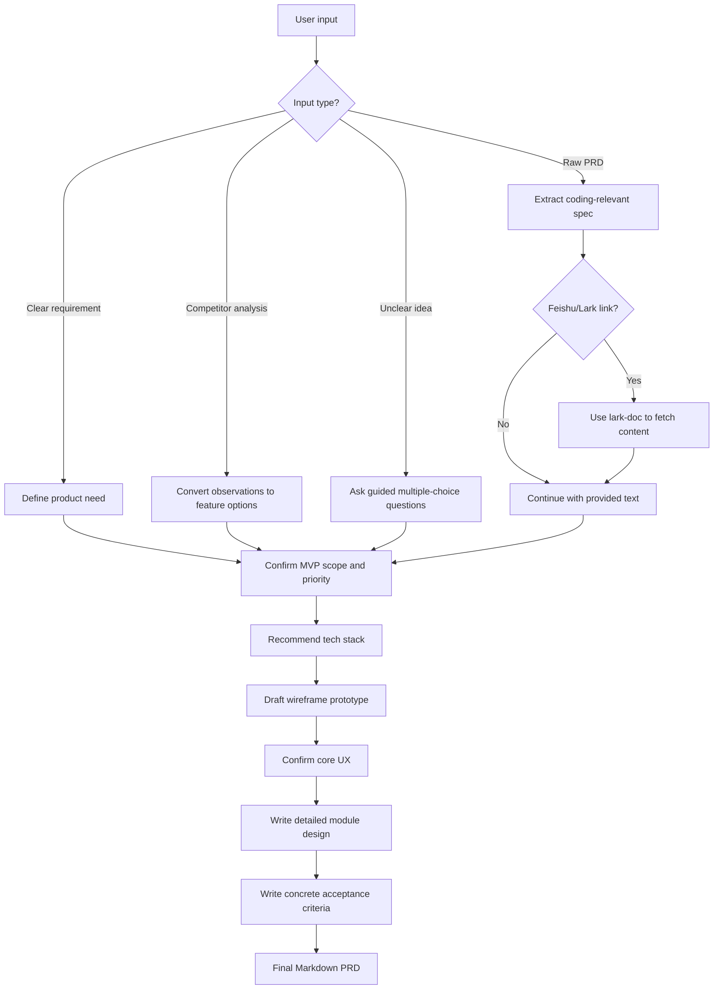

# Vibe Coding PRD

> Turn rough ideas, PRDs, competitor notes, and Feishu/Lark docs into a concise PRD that coding agents can build from.

<p align="center">
  
  
  
</p>

<p align="center">
  <b>把“我想做个东西”变成“编码 Agent 可以直接开工的 PRD”。</b>
</p>

---

## What It Does

`vibe-coding-prd` is a Codex Skill for turning messy product input into a compact, implementation-ready PRD.

It helps with:

| Input | What the skill extracts |
|---|---|
| Clear requirements | User, scenario, pain point, product form, MVP scope |
| Raw PRDs | Coding-relevant information, minus business narration |
| Competitor analysis | Product direction, candidate features, differentiators |
| Feishu/Lark docs | Source PRD content via `lark-doc`, then distilled for coding agents |
| Unclear ideas | Multiple-choice clarification before drafting |

## Workflow



## PRD Output Structure

```text
# [Product Name] Vibe Coding PRD

1. Requirement Definition
2. MVP Scope And Priority
3. Recommended Tech Stack
4. Prototype Wireframe
5. Detailed Functional Design
6. Acceptance Criteria
7. Out Of Scope
8. Open Questions
```

## Design Principles

| Principle | Meaning |
|---|---|
| No guessing | If intent is unclear, the agent must ask before drafting |
| Coding-agent first | Prefer screens, states, flows, tools, prompts, APIs, and acceptance criteria |
| Lean PRD | Remove business-value prose and stakeholder-report style filler |
| MVP aware | Separate must-build features from later improvements |
| Testable | Every feature gets observable acceptance criteria |

## Example Trigger

```text
帮我写一个用来vibe coding的PRD
```

You can follow it with:

```text
我想做一个给自媒体团队用的选题和脚本生成工具，可以参考这份竞品分析...
```

or:

```text
这是一个飞书 PRD 链接，请帮我提炼成能直接发给 Codex 的 Vibe coding PRD: https://...
```

## Installation

Clone or copy this repository into your Codex skills directory:

```bash
mkdir -p ~/.codex/skills
git clone https://github.com/suqiyue2001/vibe-coding-prd.git ~/.codex/skills/vibe-coding-prd
```

After installation, start a new Codex thread and invoke:

```text
Use $vibe-coding-prd to turn my requirements into a concise coding-ready PRD.
```

## Repository Layout

```text
vibe-coding-prd/
├── SKILL.md
├── README.md
└── agents/
    └── openai.yaml
```

## For Coding Agents

This skill is intentionally small. The core workflow lives in [`SKILL.md`](./SKILL.md), while [`agents/openai.yaml`](./agents/openai.yaml) provides Codex UI metadata.
